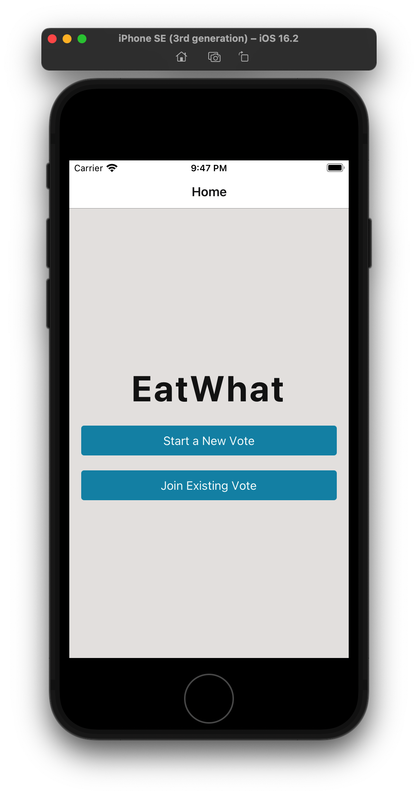
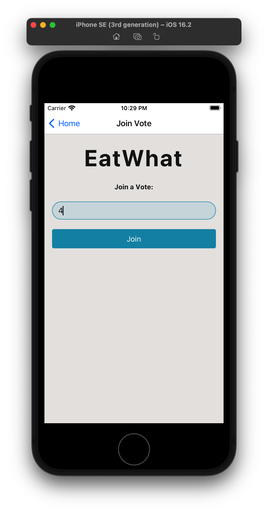
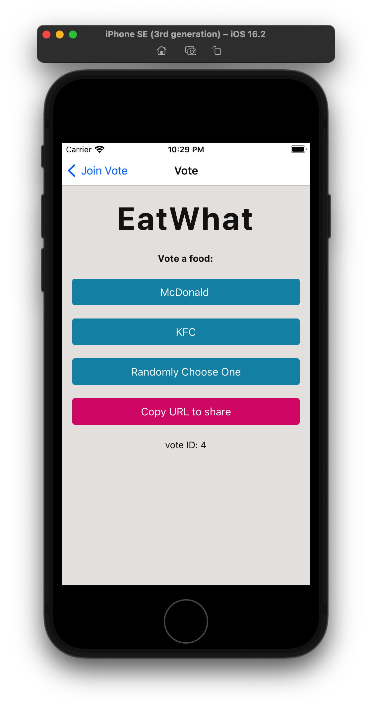
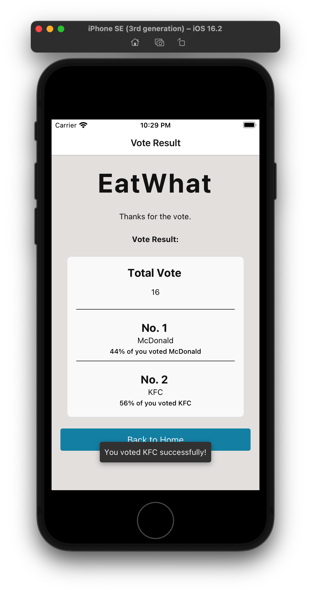
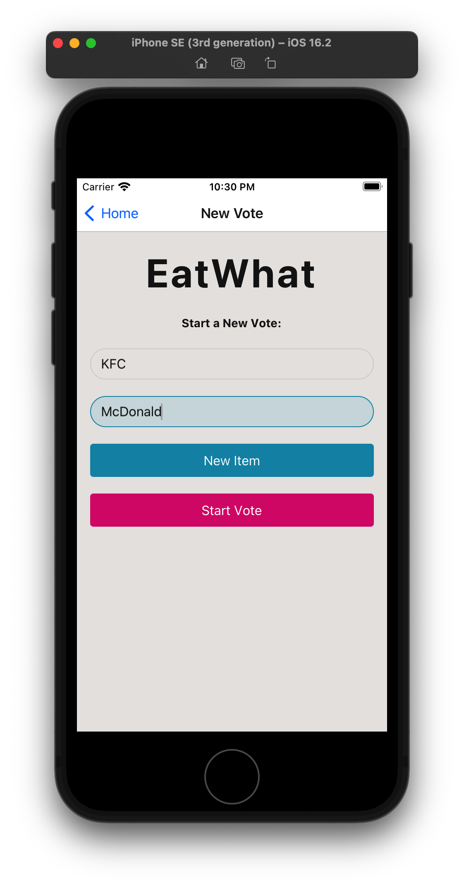

# EatWhat App

The mobile app version of the website [EatWhat](https://github.com/redfrogsss/EatWhat). 

## What is this?

This app allows users to start a vote and ask their friends to choose what to eat for the lunch or dinner. 

This app tries to solve a simple yet annoying problem: `What should we eat for lunch / dinner?`. To solve this problem, the user who start the vote need to input a set of options for lunch / dinner. Then, his/her friends could enter the vote using a code and choose their preferred options or choose randomly by clicking a button. At the end, the option with the highest votes will be the final choice.

## Screenshots

Home Screen


Join Vote Screen


Vote Screen


Vote Result Screen


New Vote Screen


## Usage

To run this app, you need to setup the website version of EatWhat first. Please refer to [EatWhat's Repo](https://github.com/redfrogsss/EatWhat).

Then, start the Expo server by running the following command:

```sh
yarn start
```

## Environment
- `API_URL`: the backend API's URL. (e.g. `API_URL=http://192.168.3.59:8000`)

## Learn More

This is my first react native project.

The following tech is used in this project:
- React Native
- React Navigation
- NativeBase
